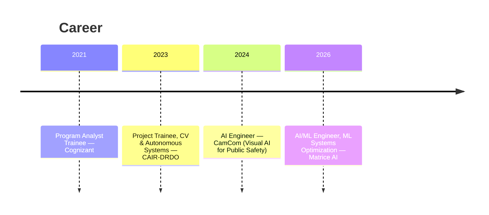

<!-- ═══════════════════════════ HEADER ═══════════════════════════ -->
<p align="center">
  
</p>

<p align="center">
  
</p>

<p align="center">
  <a href="https://www.linkedin.com/in/agasthya-omkumar/"></a>
  <a href="https://www.credly.com/users/agasthya-omkumar/badges"></a>
  <a href="mailto:agasthya611@gmail.com"></a>
  <a href="https://github.com/AGasthya283"></a>
</p>

<p align="center">
  
  
  
  
</p>

---

<!-- ═══════════════════════════ ABOUT ═══════════════════════════ -->
## 🧭 About

> **AI/ML Engineer with 3+ years** building Computer Vision, GenAI/LLM and MLOps systems that run in production — **10M+ camera streams** and **6–8M images/month**. I work where applied mathematics meets real-time perception: trackers, filters and transformers that have to hold latency budgets, not just benchmarks.

```yaml
name:       Agasthya Omkumar
role:       AI/ML Engineer — ML Systems Optimization @ Matrice AI
location:   Bengaluru, Karnataka, India
education:
  - M.Tech, Applied Mathematics — DIAT (DRDO)   # CGPA 8.26
  - B.E.,   Mechanical Engineering — BNMIT, VTU # CGPA 8.34
focus:      [ Computer Vision, Multi-Object Tracking, Real-Time Inference,
              GenAI / LLMs / VLMs, Model Optimization, MLOps ]
ask-me-about: [ DeepSORT · ByteTrack · StrongSORT, Kalman filters, HMMs,
                sensor fusion, RAG pipelines, Triton + CUDA serving ]
```

<table>
<tr><td width="50%" valign="top">

**🏆 Selected results**
- 🥇 **4th Place (International)** — ICPR 2024 VISTAC Challenge, adaptive visual tracking under fog, rain, low-light and thermal
- 🛡️ **Finalist, KAVACH 2023** — Top **5 of 3,900** teams, national cybersecurity hackathon
- 🎓 **Head Volunteer, ICDMAI 2023** — logistics for 100+ participants
- 🌐 **45+ public repositories** on tracking, filtering and ML optimization

</td><td width="50%" valign="top">

**📈 Production impact**
- **10M+** camera streams served in real time
- **6–8M** images/month across **147+** violation categories
- **+47%** mean precision & recall via synthetic data generation
- **−64%** dataset curation effort through automated annotation
- **ID-switches to near-zero** with AIS–video sensor fusion

</td></tr>
</table>

---

<!-- ═══════════════════════════ STACK ═══════════════════════════ -->
## 🛠️ Tech Stack

<div align="center">

**Languages**


**Deep Learning · Vision**


**GenAI · LLM · Agents**


**Vector Databases**


**MLOps · Systems**


</div>

---

<!-- ═══════════════════════════ EXPERIENCE ═══════════════════════════ -->
## 💼 Experience



### 🔹 AI/ML Engineer — ML Systems Optimization · **Matrice AI**
`May 2026 – Present` · Bengaluru, KA
> Real-time video analytics at scale — inference pipelines, streaming throughput and multi-model GPU serving.

### 🔹 AI Engineer · **CamCom** (Visual AI for Public Safety)
`Oct 2024 – Apr 2026` · Bengaluru, KA
- Designed the detection architecture for the **world's largest automated urban safety inspection system** — **6–8M images/month** across **147+ violation categories** in multiple cities.
- Built foundational **urban scene segmentation** models on EMT-Data and the India Driving Dataset (**0.6 mAP**); added **monocular depth estimation** to filter distant objects and cut false positives.
- Raised mean precision & recall across all classes by **47%** using **GAN-based synthetic data generation** and negative data mining for rare violation classes.
- Automated annotation with **Label Studio + SAM2** pre-annotation and GenAI mask refinement — **64% less curation effort** — plus confidence-based active learning with human-in-the-loop escalation.
- Evaluated and integrated **VLMs (Qwen-VL, GLM-4V)** and LLM reasoning layers for violation explainability, summarization, zero-shot classification and agent-driven analytics.
- Engineered **geolocation estimation** (camera intrinsics + GPS + GIS) projecting detections into world coordinates for city-level planning; enforced violation rules and **PII protection** with LLM-assisted validation.
- Maintained the **MLOps stack** (Triton Inference Server, Docker) for vision and multimodal deployment; led OEM defect-detection demos and pilots across India and abroad.

### 🔹 Project Trainee — Computer Vision & Autonomous Systems · **CAIR-DRDO**
`Aug 2023 – Sep 2024` · Bengaluru, KA
- Led applied research on **UAV-based Multi-Object Tracking** for maritime surveillance and search & rescue under extreme viewpoint, scale and weather variation.
- Designed a novel **AIS–video sensor fusion pipeline**, associating Automatic Identification System data with visual detections in real time — **ID-switches to near-zero**, outperforming vision-only tracking.
- Benchmarked **transformers (ViT, Swin)** against CNN baselines (YOLOv8, Faster R-CNN) with **DeepSORT / ByteTrack**, characterizing accuracy–latency trade-offs on GPU and **Jetson** edge devices.
- Developed **Kalman filter data association** with adaptive process noise, robustly tracking **15+ simultaneous targets** under sensor dropout and occlusion; contributed to multi-UAV distributed perception.

### 🔹 Program Analyst Trainee · **Cognizant**
`Mar 2021 – Dec 2021` · Bengaluru, KA
- Designed and maintained **MySQL** schemas and optimized queries for web and enterprise applications.

---

<!-- ═══════════════════════════ PROJECTS ═══════════════════════════ -->
## 🚀 Featured Projects

| Project | What it does | Stack |
|---|---|---|
| **Zero-Copy Video Inference Pipeline** | Shared-memory frame-buffer pool with reference-counted lease/return semantics and seqlock concurrency for zero-copy flow across decode → inference → postprocessing, with graceful fallback on pool saturation | C++ · CUDA · SHM |
| [**Multi-Object Tracking Toolkit**](https://github.com/AGasthya283/Multi-Object-Tracking) | YOLOv8 detection + DeepSORT/ByteTrack association + monocular depth cues, with a Streamlit dashboard for real-time tracker comparison | YOLOv8 · DeepSORT · ByteTrack · OpenCV |
| [**Multi-Object-Tracking-Cpp**](https://github.com/AGasthya283/Multi-Object-Tracking-Cpp) | The same tracking stack rebuilt in C++ for real-time throughput | C++ · OpenCV |
| **Vittiya Anveshak** — *Financial Anomaly Detection* | Fund-trail analysis platform using **HMMs** with hierarchical, regime-switching and **Hidden Semi-Markov** extensions to detect irregular fund flows; augmented sparse labels with CTGAN synthetic transactions · **Finalist, KAVACH 2023 — Top 5 of 3,900** | Flask · HMM · CTGAN |
| [**spatial-temporal-vod**](https://github.com/AGasthya283/spatial-temporal-vod) | From-scratch reimplementation of **TransVOD** (He et al., ACM MM 2021) + Streamlit demo and novice-friendly CV tutorials | PyTorch · Transformers · Streamlit |
| [**Sign-Language-Video-Recognition**](https://github.com/AGasthya283/Sign-Language-Video-Recognition) | **LRCN (CNN + LSTM)** spatio-temporal model for gesture-to-text video translation | PyTorch · LRCN |
| [**Monte-Carlo-Simulator**](https://github.com/AGasthya283/Monte-Carlo-Simulator) | Derivative pricing with variance reduction — GBM, Jump Diffusion, Heston | Python · NumPy · SciPy |
| [**Hidden_Markov_Models**](https://github.com/AGasthya283/Hidden_Markov_Models) | HMMs applied to financial regime detection | Python · hmmlearn |
| [**Kalman_Filters**](https://github.com/AGasthya283/Kalman_Filters) | Kalman / extended Kalman filtering from first principles | Python · NumPy |
| [**foodvision-agent**](https://github.com/AGasthya283/foodvision-agent) | Agentic food-vision assistant with retrieval over a local LLM | CrewAI · FAISS · Ollama · Gradio |

---

<!-- ═══════════════════════════ STATS ═══════════════════════════ -->
## 📊 GitHub Activity

<div align="center">


<br/><br/>


<br/><br/>


</div>

<!--
  OPTIONAL — github-readme-stats cards.
  The public instance (github-readme-stats.vercel.app) is currently PAUSED and
  github-profile-trophy / github-readme-activity-graph are over their Vercel quota (HTTP 402),
  so they are left commented out rather than rendering as broken images.
  To enable: deploy your own instance (https://github.com/anuraghazra/github-readme-stats#deploy-on-your-own-vercel-instance),
  then replace YOUR-INSTANCE below and uncomment.

  
  
-->

---

<!-- ═══════════════════════════ CERTIFICATIONS ═══════════════════════════ -->
## 🏅 Certifications

<p align="center">
  <b>29 verified badges</b> from IBM, Coursera and Microsoft ·
  <a href="https://www.credly.com/users/agasthya-omkumar/badges"><b>verify on Credly →</b></a>
</p>

<details open>
<summary><b>🧠 AI &amp; Deep Learning</b></summary>

| Credential | Issuer | Level | Earned |
|---|---|---|---|
| [IBM AI Engineering Professional Certificate (V3)](https://www.credly.com/org/coursera/badge/ibm-ai-engineering-professional-certificate-v3) | Coursera | Advanced | May 2025 |
| [AI Capstone Project with Deep Learning](https://www.credly.com/org/coursera/badge/ai-capstone-project-with-deep-learning) | Coursera | Advanced | May 2025 |
| [Deep Learning using TensorFlow](https://www.credly.com/org/ibm/badge/deep-learning-using-tensorflow) | IBM | Advanced | Jan 2025 |
| [Accelerated Deep Learning with GPU](https://www.credly.com/org/ibm/badge/accelerated-deep-learning-with-gpu) | IBM | Advanced | Jan 2025 |
| [Advanced Deep Learning Specialist](https://www.credly.com/org/coursera/badge/advanced-deep-learning-specialist) | Coursera | Intermediate | May 2025 |
| [Deep Learning with PyTorch](https://www.credly.com/org/coursera/badge/deep-learning-with-pytorch) | Coursera | Intermediate | May 2025 |

</details>

<details>
<summary><b>✨ Generative AI &amp; LLMs</b></summary>

| Credential | Issuer | Level | Earned |
|---|---|---|---|
| [Generative AI Applications Specialist](https://www.credly.com/org/coursera/badge/generative-ai-applications-specialist) | Coursera | Intermediate | May 2025 |
| [AI Agents Using RAG and LangChain](https://www.credly.com/org/coursera/badge/ai-agents-using-rag-and-langchain) | Coursera | Intermediate | May 2025 |
| [Generative AI Advanced Fine-Tuning for LLMs](https://www.credly.com/org/coursera/badge/generative-ai-advanced-fine-tuning-for-llms) | Coursera | Intermediate | May 2025 |
| [Generative AI Engineering with Transformers &amp; LLMs](https://www.credly.com/org/coursera/badge/generative-ai-engineering-with-transformers-llms) | Coursera | Intermediate | May 2025 |
| [Generative AI Language Modeling with Transformers](https://www.credly.com/org/coursera/badge/generative-ai-language-modeling-with-transformers) | Coursera | Intermediate | May 2025 |
| [Generative AI Foundational Models for NLP](https://www.credly.com/org/coursera/badge/generative-ai-foundational-models-for-nlp-language-) | Coursera | Intermediate | May 2025 |
| [Generative AI and LLMs: Architecture and Data Preparation](https://www.credly.com/org/coursera/badge/generative-ai-and-llms-architecture-and-data-prepar) | Coursera | Intermediate | May 2025 |

</details>

<details>
<summary><b>☁️ Cloud, Containers &amp; Security</b></summary>

| Credential | Issuer | Level | Earned |
|---|---|---|---|
| [Docker Essentials: A Developer Introduction](https://www.credly.com/org/ibm/badge/docker-essentials-a-developer-introduction) | IBM | Foundational | Jan 2026 |
| [Containers &amp; Kubernetes Essentials](https://www.credly.com/org/ibm/badge/containers-kubernetes-essentials) | IBM | Intermediate | Nov 2025 |
| [Microsoft Certified: Azure Data Fundamentals](https://www.credly.com/org/microsoft-certification/badge/microsoft-certified-azure-data-fundamentals) | Microsoft | — | Sep 2024 |
| [Quantum-Safe Encryption Essentials](https://www.credly.com/org/ibm/badge/quantum-safe-encryption-essentials) | IBM | Foundational | Mar 2025 |

</details>

<details>
<summary><b>📊 Data Science &amp; Big Data</b></summary>

| Credential | Issuer | Level | Earned |
|---|---|---|---|
| [DataOps Methodology](https://www.credly.com/org/ibm/badge/dataops-methodology) | IBM | Foundational | Mar 2025 |
| [Data Visualization Using Python](https://www.credly.com/org/ibm/badge/data-visualization-using-python) | IBM | Intermediate | Jul 2024 |
| [Machine Learning with Python — Level 1](https://www.credly.com/org/ibm/badge/machine-learning-with-python-level-1) | IBM | Foundational | May 2024 |
| [Data Analysis Using Python](https://www.credly.com/org/ibm/badge/data-analysis-using-python) | IBM | Intermediate | Oct 2023 |
| [Spark — Level 1](https://www.credly.com/org/ibm/badge/spark-level-1) | IBM | Foundational | Sep 2023 |
| [Python for Data Science](https://www.credly.com/org/ibm/badge/python-for-data-science) | IBM | Foundational | Sep 2023 |
| [Hadoop Foundations — Level 1](https://www.credly.com/org/ibm/badge/hadoop-foundations-level-1) | IBM | Foundational | Jun 2023 |
| [Big Data Foundations — Level 1](https://www.credly.com/org/ibm/badge/big-data-foundations-level-1) | IBM | Foundational | May 2023 |
| [Data Science Foundations — Level 2 (V2)](https://www.credly.com/org/ibm/badge/data-science-foundations-level-2-v2) | IBM | Foundational | May 2023 |
| [Data Science Methodologies](https://www.credly.com/org/ibm/badge/data-science-methodologies) | IBM | Foundational | May 2023 |
| [Data Science Tools](https://www.credly.com/org/ibm/badge/data-science-tools) | IBM | Foundational | Mar 2023 |
| [Data Science Foundations — Level 1](https://www.credly.com/org/ibm/badge/data-science-foundations-level-1) | IBM | Foundational | Jan 2023 |

</details>

---

<!-- ═══════════════════════════ CONNECT ═══════════════════════════ -->
## 🤝 Let's build something

<p align="center">
  Open to <b>AI Engineer / ML Engineer</b> roles building high-impact, scalable AI products.
</p>

<p align="center">
  <a href="https://www.linkedin.com/in/agasthya-omkumar/"></a>
  <a href="mailto:agasthya611@gmail.com"></a>
  <a href="https://www.credly.com/users/agasthya-omkumar/badges"></a>
</p>

<p align="center"><i>"Everything is a filtering problem if you look at it long enough."</i></p>

<p align="center">
  
</p>
